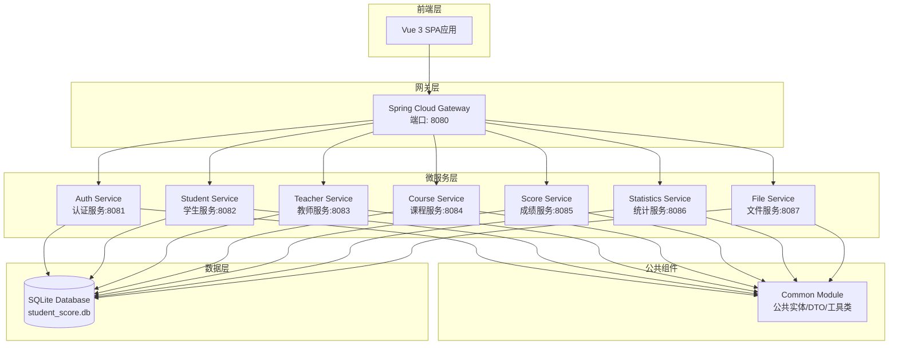
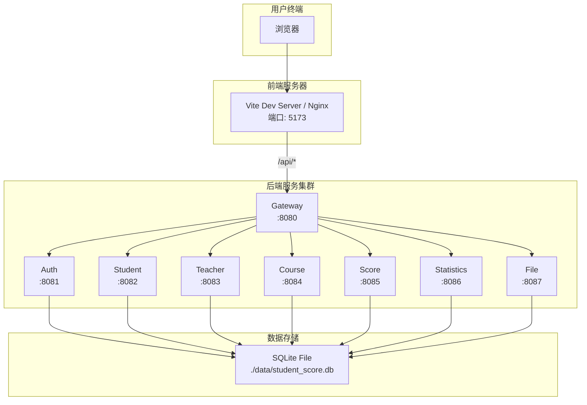
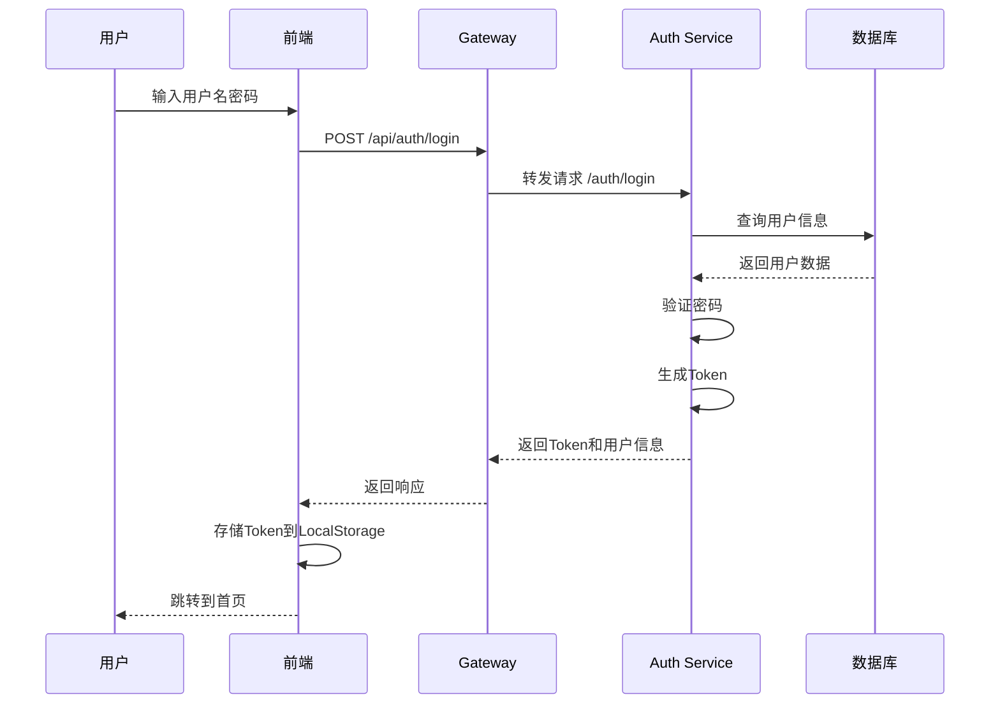
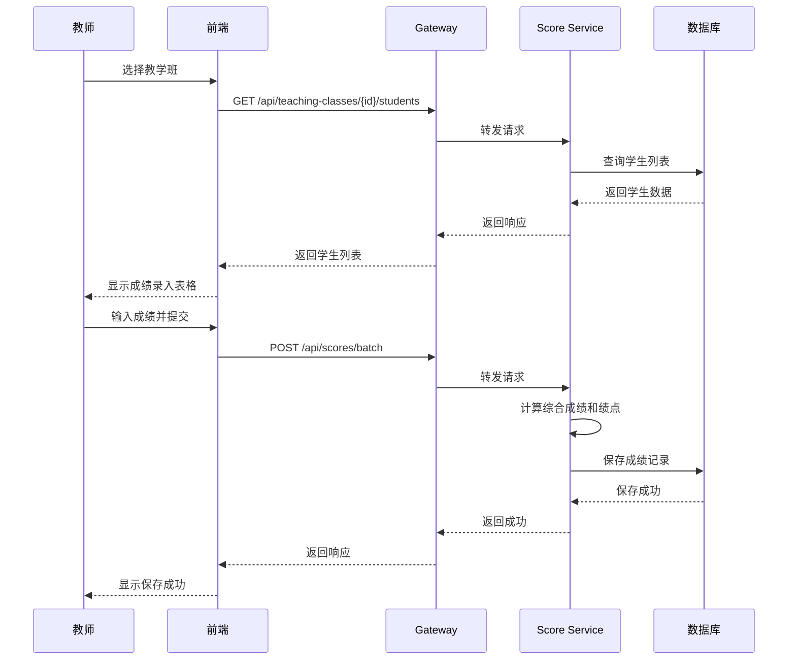
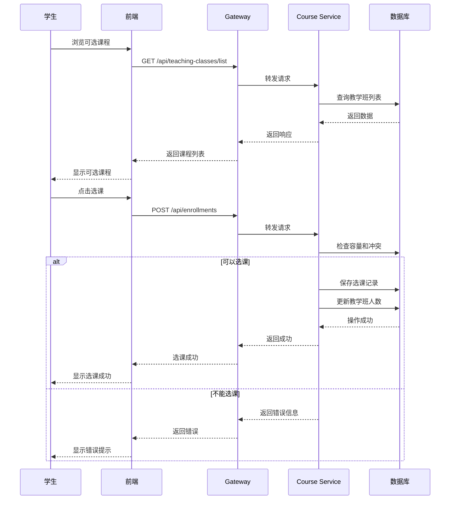
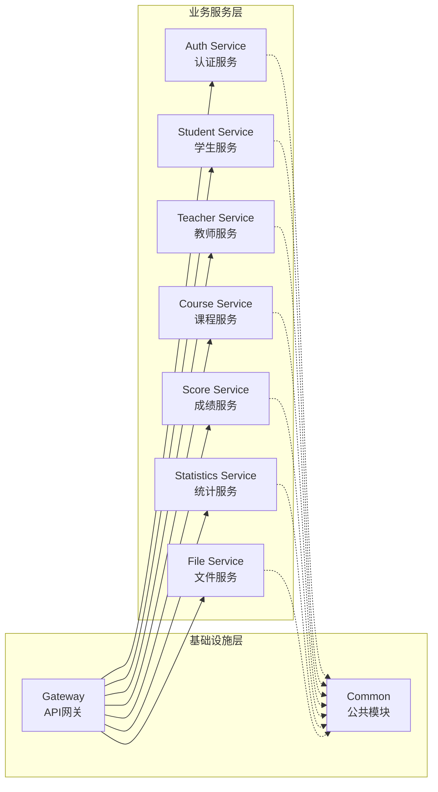
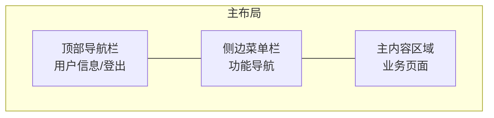
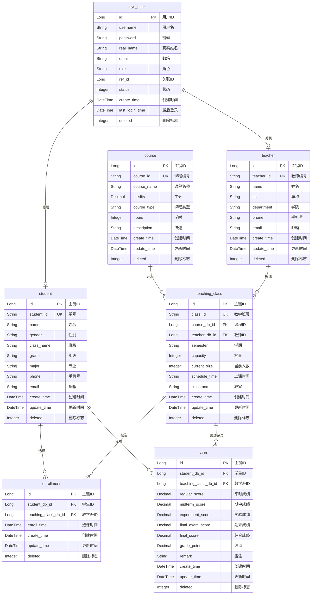

# 分布式微服务学生成绩管理系统实验报告

---

## 一、软件的功能介绍和特色

### 1. 软件功能

本系统是一个基于Spring Cloud分布式微服务架构的学生成绩管理系统，将原有的单体SpringBoot应用成功改造为微服务架构。系统实现了完整的学生成绩管理业务闘，主要功能包括：

#### 1.1 用户认证与权限管理
- **多角色支持**：系统支持管理员（ADMIN）、教师（TEACHER）、学生（STUDENT）三种角色
- **统一登录认证**：基于Token的无状态认证机制
- **权限控制**：不同角色拥有不同的操作权限和可访问菜单

#### 1.2 基础数据管理
- **学生管理**：学生信息的增删改查、批量操作、Excel导入导出
- **教师管理**：教师信息维护、教学班分配
- **课程管理**：课程信息管理、学分学时配置
- **教学班管理**：教学班创建、教师分配、学生选课容量控制

#### 1.3 成绩管理
- **成绩录入**：支持平时成绩、期中成绩、实验成绩、期末成绩分阶段录入
- **自动计算**：按权重自动计算综合成绩和绩点（平时20%+期中20%+实验20%+期末40%）
- **成绩查询**：多条件组合查询、按学号/课程/教学班筛选
- **成绩排名**：支持班级排名、全校排名等多维度排名

#### 1.4 选课管理
- **学生选课**：学生可自主选择课程和教学班
- **容量控制**：自动检查教学班容量，防止超额
- **退课功能**：支持学生退选已选课程

#### 1.5 统计分析
- **数据概览**：学生总数、教师总数、课程数、成绩记录数等
- **成绩分布**：按分数段统计人数分布
- **及格率/优秀率**：自动计算各项统计指标
- **可视化图表**：基于ECharts的成绩趋势和分布图表

#### 1.6 数据导入导出
- **Excel导入**：批量导入学生、教师、课程、成绩数据
- **Excel导出**：将数据导出为Excel文件
- **模板下载**：提供标准数据导入模板

### 2. 创新点和特色

#### 2.1 微服务架构设计
- **服务拆分合理**：按业务领域将系统拆分为8个独立微服务
- **统一网关**：使用Spring Cloud Gateway实现请求路由和跨域处理
- **服务间通信**：采用OpenFeign进行声明式服务调用

#### 2.2 技术栈先进
- **Spring Boot 3.2.0**：采用最新LTS版本，支持Java 17
- **Spring Cloud 2023.0.0**：最新的微服务框架版本
- **Vue 3 + Element Plus**：现代化的前端技术栈
- **MyBatis-Plus 3.5.5**：简化数据库操作

#### 2.3 轻量级数据存储
- **SQLite数据库**：无需安装独立数据库服务，简化部署
- **共享数据文件**：各微服务共享同一数据库文件，保证数据一致性

#### 2.4 用户体验优化
- **响应式设计**：支持PC和移动端访问
- **角色定制界面**：不同角色看到不同的统计数据和操作入口
- **快捷入口**：首页提供常用功能快捷访问

#### 2.5 开发效率工具
- **Knife4j集成**：每个微服务独立的API文档
- **统一异常处理**：全局异常捕获和标准化响应
- **代码生成**：基于MyBatis-Plus的代码生成器

---

## 二、开发和运行环境

### 1. 开发平台

| 项目 | 说明 |
|------|------|
| 操作系统 | macOS / Windows / Linux |
| JDK版本 | Java 17 (OpenJDK 17) |
| Node.js | v18.x 或更高版本 |
| IDE | IntelliJ IDEA 2023.x / VS Code |
| 构建工具 | Maven 3.8+ |
| 包管理 | npm / pnpm |

### 2. 运行平台

| 项目 | 说明 |
|------|------|
| 后端服务 | JVM 17+ 运行时环境 |
| 前端服务 | Vite 5.0 开发服务器 / Nginx（生产环境） |
| 数据库 | SQLite 3.44.1（嵌入式） |
| 浏览器 | Chrome / Firefox / Edge（现代浏览器） |

### 3. 第三方组件使用情况

#### 3.1 后端依赖

| 组件名称 | 版本 | 用途 |
|----------|------|------|
| Spring Boot | 3.2.0 | 基础框架 |
| Spring Cloud | 2023.0.0 | 微服务框架 |
| Spring Cloud Gateway | - | API网关 |
| Spring Cloud OpenFeign | - | 服务间调用 |
| MyBatis-Plus | 3.5.5 | ORM框架 |
| SQLite JDBC | 3.44.1.0 | 数据库驱动 |
| Knife4j | 4.3.0 | API文档 |
| EasyExcel | 3.3.3 | Excel处理 |
| Hutool | 5.8.23 | 工具类库 |
| Lombok | - | 代码简化 |

#### 3.2 前端依赖

| 组件名称 | 版本 | 用途 |
|----------|------|------|
| Vue | 3.4.0 | 前端框架 |
| Vue Router | 4.2.5 | 路由管理 |
| Pinia | 2.1.7 | 状态管理 |
| Element Plus | 2.5.0 | UI组件库 |
| Axios | 1.6.2 | HTTP客户端 |
| ECharts | 5.4.3 | 图表库 |
| Day.js | 1.11.10 | 日期处理 |
| Vite | 5.0.0 | 构建工具 |
| Sass | 1.69.5 | CSS预处理 |

### 4. 其他支撑软件运行的条件

- **网络环境**：微服务间通过HTTP协议通信，需确保端口可访问
- **端口要求**：
  - Gateway: 8080
  - Auth Service: 8081
  - Student Service: 8082
  - Teacher Service: 8083
  - Course Service: 8084
  - Score Service: 8085
  - Statistics Service: 8086
  - File Service: 8087
  - Frontend Dev Server: 5173

---

## 三、设计说明

### 3. 总体设计思想

本系统采用**领域驱动设计（DDD）**思想，将复杂的学生成绩管理业务按照业务边界拆分为多个独立的微服务。每个微服务负责一个明确的业务领域，具有独立的代码库、独立部署能力，通过API网关统一对外提供服务。

**设计原则**：
- **单一职责原则**：每个微服务只负责一个业务领域
- **接口隔离原则**：服务间通过RESTful API通信，接口定义清晰
- **依赖倒置原则**：通过抽象（接口）进行依赖，便于扩展
- **高内聚低耦合**：服务内部高度内聚，服务间松散耦合

### 4. 设计模式的使用

#### 4.1 工厂模式
用于创建统一响应对象`Result<T>`，提供静态工厂方法：

```java
public static <T> Result<T> success(T data) {
    return new Result<>(ResultCode.SUCCESS.getCode(),
                        ResultCode.SUCCESS.getMessage(), data);
}

public static <T> Result<T> error(String message) {
    return new Result<>(ResultCode.ERROR.getCode(), message, null);
}
```

#### 4.2 策略模式
成绩计算采用策略模式，支持不同的成绩权重配置：

```java
// 成绩计算策略：平时20% + 期中20% + 实验20% + 期末40%
public void calculateFinalScore() {
    total = total.add(regularScore.multiply(new BigDecimal("0.2")));
    total = total.add(midtermScore.multiply(new BigDecimal("0.2")));
    total = total.add(experimentScore.multiply(new BigDecimal("0.2")));
    total = total.add(finalExamScore.multiply(new BigDecimal("0.4")));
}
```

#### 4.3 代理模式
OpenFeign使用动态代理实现服务间调用：

```java
@FeignClient(name = "student-service", url = "${service.student-url}")
public interface StudentFeignClient {
    @GetMapping("/students/{id}")
    Result<Student> getById(@PathVariable("id") Long id);
}
```

#### 4.4 门面模式
Controller层作为门面，封装复杂的业务逻辑，对外提供简洁的API接口。

#### 4.5 单例模式
Spring容器管理的Bean默认采用单例模式，如Service、Repository等组件。

### 5. 程序的结构或架构

#### 5.1 代码组织结构

```
distributed_system_by_springboot/
├── microservices/                    # 后端微服务
│   ├── pom.xml                       # 父POM
│   ├── common/                       # 公共模块
│   │   └── src/main/java/com/example/common/
│   │       ├── entity/               # 实体类
│   │       ├── dto/                  # 数据传输对象
│   │       ├── vo/                   # 视图对象
│   │       ├── query/                # 查询条件
│   │       ├── result/               # 统一响应
│   │       ├── util/                 # 工具类
│   │       └── exception/            # 异常处理
│   ├── gateway/                      # API网关
│   ├── auth-service/                 # 认证服务
│   ├── student-service/              # 学生服务
│   ├── teacher-service/              # 教师服务
│   ├── course-service/               # 课程服务
│   ├── score-service/                # 成绩服务
│   ├── statistics-service/           # 统计服务
│   └── file-service/                 # 文件服务
│
└── frontend/                         # 前端项目
    ├── src/
    │   ├── api/                      # API接口定义
    │   ├── views/                    # 页面组件
    │   ├── stores/                   # Pinia状态管理
    │   ├── router/                   # 路由配置
    │   ├── layouts/                  # 布局组件
    │   └── utils/                    # 工具函数
    └── package.json
```

#### 5.2 软件设计架构



#### 5.3 部署架构



### 6. 程序主要执行流程图

#### 6.1 用户登录流程



#### 6.2 成绩录入流程



#### 6.3 学生选课流程



### 7. 前后端交互接口设计

#### 7.1 接口规范

所有接口遵循RESTful设计风格，统一响应格式如下：

```json
{
    "code": 200,
    "message": "操作成功",
    "data": {},
    "timestamp": 1703836800000
}
```

#### 7.2 主要接口列表

| 服务 | 接口路径 | 方法 | 说明 |
|------|----------|------|------|
| **认证服务** |
| | /api/auth/login | POST | 用户登录 |
| | /api/auth/logout | POST | 用户登出 |
| | /api/auth/user-info | GET | 获取当前用户信息 |
| | /api/auth/change-password | POST | 修改密码 |
| **学生服务** |
| | /api/students/page | GET | 分页查询学生 |
| | /api/students/list | GET | 获取所有学生 |
| | /api/students/{id} | GET | 根据ID获取学生 |
| | /api/students | POST | 新增学生 |
| | /api/students | PUT | 更新学生 |
| | /api/students/{id} | DELETE | 删除学生 |
| | /api/students/{studentId}/scores | GET | 获取学生成绩详情 |
| **教师服务** |
| | /api/teachers/page | GET | 分页查询教师 |
| | /api/teachers/list | GET | 获取所有教师 |
| | /api/teachers/{id} | GET | 根据ID获取教师 |
| | /api/teachers | POST | 新增教师 |
| | /api/teachers | PUT | 更新教师 |
| | /api/teachers/{id} | DELETE | 删除教师 |
| **课程服务** |
| | /api/courses/page | GET | 分页查询课程 |
| | /api/courses/list | GET | 获取所有课程 |
| | /api/teaching-classes/page | GET | 分页查询教学班 |
| | /api/teaching-classes/list | GET | 获取教学班列表 |
| | /api/enrollments | POST | 学生选课 |
| | /api/enrollments/{id} | DELETE | 退课 |
| **成绩服务** |
| | /api/scores/page | GET | 分页查询成绩 |
| | /api/scores | POST | 录入成绩 |
| | /api/scores/batch | POST | 批量录入成绩 |
| | /api/scores | PUT | 更新成绩 |
| | /api/scores/ranking | GET | 成绩排名 |
| **统计服务** |
| | /api/statistics/overview | GET | 系统概览统计 |
| | /api/statistics/score-distribution | GET | 成绩分布 |
| | /api/statistics/course-average | GET | 课程平均分 |
| | /api/statistics/class-comparison | GET | 班级对比 |
| **文件服务** |
| | /api/excel/import/students | POST | 导入学生数据 |
| | /api/excel/export/students | GET | 导出学生数据 |
| | /api/excel/import/scores | POST | 导入成绩数据 |
| | /api/excel/export/scores | GET | 导出成绩数据 |
| | /api/excel/template/{type} | GET | 下载导入模板 |

#### 7.3 网关路由配置

```yaml
spring:
  cloud:
    gateway:
      routes:
        - id: auth-service
          uri: http://localhost:8081
          predicates:
            - Path=/api/auth/**
          filters:
            - StripPrefix=1

        - id: student-service
          uri: http://localhost:8082
          predicates:
            - Path=/api/students/**
          filters:
            - StripPrefix=1

        # ... 其他路由配置
```

### 8. 安全设计

由于本系统为教学演示项目，按照项目规范要求，安全功能已简化处理：

#### 8.1 当前实现
- **Token认证**：基于简单Token的用户认证机制
- **角色控制**：前端路由守卫实现基于角色的访问控制
- **密码存储**：使用简单加密存储用户密码

#### 8.2 简化说明
- 未实现JWT Token的签名验证
- 未实现HTTPS传输加密
- 未实现详细的操作审计日志

### 9. 后端微服务架构设计

#### 9.1 微服务拆分



#### 9.2 各服务职责

| 服务名称 | 端口 | 职责 |
|----------|------|------|
| gateway | 8080 | API路由、跨域处理、请求转发 |
| auth-service | 8081 | 用户认证、登录登出、密码管理 |
| student-service | 8082 | 学生信息CRUD、成绩详情查询 |
| teacher-service | 8083 | 教师信息CRUD、教学班关联 |
| course-service | 8084 | 课程管理、教学班管理、选课管理 |
| score-service | 8085 | 成绩录入、成绩查询、成绩排名 |
| statistics-service | 8086 | 数据统计、图表分析、报表生成 |
| file-service | 8087 | Excel导入导出、文件上传下载 |

#### 9.3 服务间通信

采用OpenFeign进行服务间同步调用：

```java
@FeignClient(name = "student-service", url = "${service.student-url}")
public interface StudentFeignClient {
    @GetMapping("/students/{id}")
    Result<Student> getById(@PathVariable("id") Long id);

    @GetMapping("/students/list")
    Result<List<Student>> getList();
}
```

### 10. 前端界面设计

#### 10.1 整体布局



#### 10.2 主要页面

| 页面 | 路径 | 说明 |
|------|------|------|
| 登录页 | /login | 用户登录入口 |
| 首页概览 | /dashboard | 统计卡片、快捷入口 |
| 学生管理 | /students | 学生列表、增删改查 |
| 学生详情 | /students/:id | 学生成绩详情 |
| 教师管理 | /teachers | 教师列表管理 |
| 课程管理 | /courses | 课程信息管理 |
| 教学班管理 | /teaching-classes | 教学班配置 |
| 成绩录入 | /scores/entry | 成绩批量录入 |
| 成绩查询 | /scores/query | 成绩多条件查询 |
| 成绩排名 | /scores/ranking | 成绩排名展示 |
| 统计分析 | /statistics | 图表统计分析 |
| 选课管理 | /enrollment | 学生选课操作 |
| 我的成绩 | /my-scores | 学生个人成绩（学生） |
| 我的课程 | /my-courses | 学生已选课程（学生） |
| 我的教学班 | /teacher/classes | 教师负责的教学班（教师） |
| 班级成绩 | /teacher/scores | 教师班级成绩管理（教师） |

#### 10.3 角色菜单差异

| 菜单项 | ADMIN | TEACHER | STUDENT |
|--------|-------|---------|---------|
| 首页概览 | ✓ | ✓ | ✓ |
| 学生管理 | ✓ | ✓ | - |
| 教师管理 | ✓ | - | - |
| 课程管理 | ✓ | - | - |
| 教学班管理 | ✓ | - | - |
| 成绩录入 | ✓ | ✓ | - |
| 成绩查询 | ✓ | ✓ | ✓ |
| 成绩排名 | ✓ | ✓ | - |
| 统计分析 | ✓ | ✓ | - |
| 选课管理 | ✓ | - | ✓ |
| 我的成绩 | - | - | ✓ |
| 我的课程 | - | - | ✓ |
| 我的教学班 | - | ✓ | - |
| 班级成绩 | - | ✓ | - |

#### 10.4 核心页面详细设计

##### 10.4.1 登录页面 (Login.vue)

**功能特点**：
- 简洁美观的登录表单，支持用户名密码登录
- 表单验证：用户名必填、密码最少4位
- 提供默认测试账号提示（管理员/教师/学生）
- 渐变紫色背景，卡片式登录框
- 支持回车键快捷登录

**界面元素**：
- 系统标题和副标题
- 用户名输入框（带用户图标）
- 密码输入框（带锁图标，支持显示/隐藏）
- 登录按钮（带加载状态）
- 测试账号提示区域

##### 10.4.2 首页概览 (Dashboard.vue)

**功能特点**：
- 根据用户角色显示不同的统计数据
- 管理员：学生总数、教师总数、课程数、教学班数
- 教师：我的学生、成绩记录、我的课程、我的教学班
- 学生：我的课程、平均成绩、及格课程、优秀课程
- 快捷入口根据角色动态显示
- 系统信息卡片（版本、状态、学期、平均分、及格率）
- 功能说明折叠面板

**界面元素**：
- 四个渐变色统计卡片（支持悬停动画）
- 快捷入口网格布局
- 系统信息列表
- 功能说明折叠组件

##### 10.4.3 学生管理页面 (StudentList.vue)

**功能特点**：
- 分页表格展示学生列表
- 支持按学号/姓名关键词搜索
- 支持按性别、班级筛选
- 学生信息增删改查
- 支持导出Excel功能
- 查看学生详情和成绩

**界面元素**：
- 搜索工具栏（关键词输入、性别选择、班级选择）
- 操作按钮（导出、新增）
- 数据表格（学号、姓名、性别、班级、年级、专业、手机号、操作）
- 分页组件
- 新增/编辑对话框表单

##### 10.4.4 成绩录入页面 (ScoreEntry.vue)

**功能特点**：
- 选择教学班后显示学生列表
- 支持按成绩类型录入（平时/期中/实验/期末）
- 实时显示各项成绩和综合成绩
- 支持单个保存和批量保存
- 自动计算综合成绩（按权重）
- 成绩颜色标识（优秀绿色、及格蓝色、不及格红色）

**界面元素**：
- 教学班选择下拉框（显示班号-课程名-教师名）
- 成绩类型单选按钮组
- 学生成绩表格（可编辑的成绩输入框）
- 批量保存按钮
- 单行保存按钮

##### 10.4.5 统计分析页面 (StatisticsView.vue)

**功能特点**：
- 四个统计指标卡片（成绩记录数、平均分、及格率、优秀率）
- 成绩分布饼图（优秀/良好/中等/及格/不及格）
- 课程平均分柱状图
- 班级成绩对比图（柱状图+折线图）
- 教师角色只显示自己教学班的数据
- 图表响应式自适应

**界面元素**：
- 统计卡片行（4列响应式布局）
- 成绩分布饼图（ECharts环形图）
- 课程平均分柱状图（带颜色渐变）
- 班级对比混合图（柱状+折线）

##### 10.4.6 选课管理页面 (EnrollmentView.vue)

**功能特点**：
- 学生视角：查看可选课程，进行选课/退课
- 管理员视角：查看所有选课记录
- 显示课程信息、教师、时间地点、容量
- 防止重复选课和超额选课

##### 10.4.7 成绩查询页面 (ScoreQuery.vue)

**功能特点**：
- 多条件组合查询（学号、姓名、课程、教学班）
- 分页展示成绩记录
- 显示各项成绩和综合成绩

##### 10.4.8 成绩排名页面 (ScoreRanking.vue)

**功能特点**：
- 支持按教学班、学期筛选
- 显示学生排名、成绩、绩点
- 教师只能看到自己教学班的排名

#### 10.5 前端页面文件结构

```
frontend/src/views/
├── Login.vue                    # 登录页
├── Dashboard.vue                # 首页概览
├── students/
│   ├── StudentList.vue          # 学生列表
│   └── StudentDetail.vue        # 学生详情
├── teachers/
│   └── TeacherList.vue          # 教师列表
├── courses/
│   └── CourseList.vue           # 课程列表
├── classes/
│   └── ClassList.vue            # 教学班列表
├── scores/
│   ├── ScoreEntry.vue           # 成绩录入
│   ├── ScoreQuery.vue           # 成绩查询
│   └── ScoreRanking.vue         # 成绩排名
├── statistics/
│   └── StatisticsView.vue       # 统计分析
├── enrollment/
│   └── EnrollmentView.vue       # 选课管理
├── student/                     # 学生专属页面
│   ├── MyScores.vue             # 我的成绩
│   └── MyCourses.vue            # 我的课程
└── teacher/                     # 教师专属页面
    ├── MyClasses.vue            # 我的教学班
    └── MyScores.vue             # 班级成绩
```

### 11. 实体类和数据库表的详细设计

#### 11.1 数据库ER图



#### 11.2 实体类设计

##### Student 实体

```java
@Data
@TableName("student")
public class Student implements Serializable {
    @TableId(value = "id", type = IdType.NONE)
    private Long id;

    private String studentId;      // 学号
    private String name;           // 姓名
    private String gender;         // 性别
    private String className;      // 班级
    private String grade;          // 年级
    private String major;          // 专业
    private String phone;          // 手机号
    private String email;          // 邮箱

    @TableField(fill = FieldFill.INSERT)
    private LocalDateTime createTime;

    @TableField(fill = FieldFill.INSERT_UPDATE)
    private LocalDateTime updateTime;

    @TableLogic
    private Integer deleted;
}
```

##### Score 实体

```java
@Data
@TableName("score")
public class Score implements Serializable {
    @TableId(value = "id", type = IdType.NONE)
    private Long id;

    private Long studentDbId;           // 学生ID
    private Long teachingClassDbId;     // 教学班ID
    private BigDecimal regularScore;    // 平时成绩
    private BigDecimal midtermScore;    // 期中成绩
    private BigDecimal experimentScore; // 实验成绩
    private BigDecimal finalExamScore;  // 期末成绩
    private BigDecimal finalScore;      // 综合成绩
    private BigDecimal gradePoint;      // 绩点
    private String remark;              // 备注

    // 计算综合成绩方法
    public void calculateFinalScore() {
        // 平时20% + 期中20% + 实验20% + 期末40%
        BigDecimal total = BigDecimal.ZERO;
        if (regularScore != null)
            total = total.add(regularScore.multiply(new BigDecimal("0.2")));
        if (midtermScore != null)
            total = total.add(midtermScore.multiply(new BigDecimal("0.2")));
        if (experimentScore != null)
            total = total.add(experimentScore.multiply(new BigDecimal("0.2")));
        if (finalExamScore != null)
            total = total.add(finalExamScore.multiply(new BigDecimal("0.4")));

        this.finalScore = total.setScale(2, RoundingMode.HALF_UP);
        this.gradePoint = calculateGradePoint(this.finalScore);
    }

    // 绩点计算
    private BigDecimal calculateGradePoint(BigDecimal score) {
        double s = score.doubleValue();
        if (s >= 90) return new BigDecimal("4.0");
        if (s >= 85) return new BigDecimal("3.7");
        if (s >= 82) return new BigDecimal("3.3");
        if (s >= 78) return new BigDecimal("3.0");
        if (s >= 75) return new BigDecimal("2.7");
        if (s >= 72) return new BigDecimal("2.3");
        if (s >= 68) return new BigDecimal("2.0");
        if (s >= 64) return new BigDecimal("1.5");
        if (s >= 60) return new BigDecimal("1.0");
        return BigDecimal.ZERO;
    }
}
```

### 12. 核心源代码及说明

#### 12.1 API网关配置

**GatewayApplication.java** - 网关启动类
```java
@SpringBootApplication
public class GatewayApplication {
    public static void main(String[] args) {
        SpringApplication.run(GatewayApplication.class, args);
    }
}
```

**application.yml** - 网关路由配置
```yaml
spring:
  cloud:
    gateway:
      globalcors:
        cors-configurations:
          '[/**]':
            allowedOriginPatterns: "*"
            allowedMethods: [GET, POST, PUT, DELETE, OPTIONS]
            allowedHeaders: "*"
            allowCredentials: true
      routes:
        - id: auth-service
          uri: http://localhost:8081
          predicates:
            - Path=/api/auth/**
          filters:
            - StripPrefix=1
```

#### 12.2 统一响应处理

**Result.java** - 统一响应类
```java
@Data
public class Result<T> implements Serializable {
    private Integer code;
    private String message;
    private T data;
    private Long timestamp;

    public static <T> Result<T> success(T data) {
        return new Result<>(ResultCode.SUCCESS.getCode(),
                           ResultCode.SUCCESS.getMessage(), data);
    }

    public static <T> Result<T> error(String message) {
        return new Result<>(ResultCode.ERROR.getCode(), message, null);
    }
}
```

#### 12.3 成绩录入服务

**ScoreController.java** - 成绩控制器
```java
@RestController
@RequestMapping("/scores")
@RequiredArgsConstructor
public class ScoreController {
    private final ScoreService scoreService;

    @PostMapping("/batch")
    public Result<Boolean> saveBatch(@RequestBody List<ScoreDTO> dtos) {
        return Result.success(scoreService.saveBatch(dtos));
    }

    @GetMapping("/ranking")
    public Result<List<ScoreVO>> getRankingAll(
            @RequestParam(required = false) Long teachingClassDbId,
            @RequestParam(required = false) String semester,
            @RequestParam(required = false) Long teacherDbId) {
        return Result.success(scoreService.getRankingAll(
            teachingClassDbId, semester, teacherDbId));
    }
}
```

#### 12.4 统计分析服务

**StatisticsServiceImpl.java** - 统计服务实现
```java
@Service
@RequiredArgsConstructor
public class StatisticsServiceImpl implements StatisticsService {

    @Override
    public StatisticsVO getOverview() {
        StatisticsVO vo = new StatisticsVO();
        vo.setStudentCount(studentMapper.selectCount(null));
        vo.setTeacherCount(teacherMapper.selectCount(null));
        vo.setCourseCount(courseMapper.selectCount(null));

        // 计算平均分和及格率
        List<Score> scores = scoreMapper.selectList(null);
        if (!scores.isEmpty()) {
            List<BigDecimal> finalScores = scores.stream()
                .filter(s -> s.getFinalScore() != null)
                .map(Score::getFinalScore)
                .collect(Collectors.toList());

            BigDecimal totalScore = finalScores.stream()
                .reduce(BigDecimal.ZERO, BigDecimal::add);
            vo.setAverageScore(totalScore.divide(
                BigDecimal.valueOf(finalScores.size()), 2, RoundingMode.HALF_UP));
        }
        return vo;
    }

    @Override
    public List<Integer> getScoreDistribution() {
        List<Score> scores = scoreMapper.selectList(null);
        int[] distribution = new int[5]; // <60, 60-69, 70-79, 80-89, 90-100

        for (Score score : scores) {
            if (score.getFinalScore() != null) {
                double s = score.getFinalScore().doubleValue();
                if (s < 60) distribution[0]++;
                else if (s < 70) distribution[1]++;
                else if (s < 80) distribution[2]++;
                else if (s < 90) distribution[3]++;
                else distribution[4]++;
            }
        }
        return Arrays.stream(distribution).boxed().collect(Collectors.toList());
    }
}
```

#### 12.5 前端API封装

**api/index.js** - 前端接口封装
```javascript
export const scoreApi = {
    getPage(params) {
        return request({ url: '/scores/page', method: 'get', params })
    },

    create(data) {
        return request({ url: '/scores', method: 'post', data })
    },

    batchCreate(dataList) {
        return request({ url: '/scores/batch', method: 'post', data: dataList })
    },

    getRanking(params) {
        return request({ url: '/scores/ranking', method: 'get', params })
    }
}

export const statisticsApi = {
    getOverview(params) {
        return request({ url: '/statistics/overview', method: 'get', params })
    },

    getScoreDistribution(params) {
        return request({ url: '/statistics/score-distribution', method: 'get', params })
    }
}
```

#### 12.6 路由守卫实现

**router/index.js** - 前端路由配置
```javascript
router.beforeEach((to, from, next) => {
    document.title = to.meta.title
        ? `${to.meta.title} - 学生成绩管理系统`
        : '学生成绩管理系统'

    if (to.meta.public) {
        next()
        return
    }

    const token = localStorage.getItem('token')
    if (!token) {
        next('/login')
        return
    }

    const userInfo = JSON.parse(localStorage.getItem('userInfo') || '{}')
    const userRole = userInfo.role
    const allowedRoles = to.meta.roles

    if (allowedRoles && allowedRoles.length > 0
        && !allowedRoles.includes(userRole)) {
        next('/dashboard')
        return
    }

    next()
})
```

### 13. 人工智能应用情况

#### 13.1 使用的AI工具

本项目在开发过程中使用了**Claude**（Anthropic公司开发的AI助手）进行辅助开发。

#### 13.2 AI辅助完成的任务

1. **架构设计咨询**
   - 微服务拆分方案讨论
   - 服务间通信方式选择
   - 数据库设计建议

2. **代码生成**
   - 实体类和DTO的生成
   - Controller/Service/Mapper层代码框架
   - 前端Vue组件模板

3. **问题排查**
   - 跨域配置问题解决
   - MyBatis-Plus配置优化
   - Spring Cloud Gateway路由调试

4. **文档编写**
   - API接口文档
   - 实验报告撰写
   - 代码注释完善

#### 13.3 AI使用效果

- 显著提升了开发效率，减少了重复性编码工作
- 帮助快速理解和解决技术问题
- 提供了规范化的代码结构和设计建议
- 辅助完成了详细的项目文档

#### 13.4 AI使用心得

1. **优势**：
   - 能快速生成框架代码
   - 可以解答技术疑问
   - 帮助优化代码结构

2. **注意事项**：
   - 生成的代码需要人工审查
   - 复杂业务逻辑需要手动调整
   - 要理解AI给出方案的原理

### 14. 其他需要论述和补充的内容

#### 14.1 项目亮点

1. **完整的微服务实践**：从单体应用成功改造为8个独立微服务
2. **轻量级部署方案**：使用SQLite免去数据库安装配置
3. **现代化技术栈**：Spring Boot 3 + Vue 3 + Element Plus
4. **良好的代码组织**：公共模块抽取，代码复用率高

#### 14.2 可改进方向

1. 引入服务注册发现（如Nacos）
2. 添加分布式配置中心
3. 实现服务熔断降级（如Sentinel）
4. 引入消息队列实现异步通信
5. 使用分布式数据库替代SQLite

---

## 四、软件开发结果及分析

### 1. 开发成果展示

#### 1.1 项目结构完成情况

| 模块 | 完成状态 | 说明 |
|------|----------|------|
| API网关 | ✅ 完成 | 实现请求路由和跨域处理 |
| 认证服务 | ✅ 完成 | 登录登出和用户管理 |
| 学生服务 | ✅ 完成 | 学生信息CRUD |
| 教师服务 | ✅ 完成 | 教师信息CRUD |
| 课程服务 | ✅ 完成 | 课程、教学班、选课管理 |
| 成绩服务 | ✅ 完成 | 成绩录入和查询 |
| 统计服务 | ✅ 完成 | 数据统计和分析 |
| 文件服务 | ✅ 完成 | Excel导入导出 |
| 前端应用 | ✅ 完成 | Vue 3 SPA应用 |

#### 1.2 功能测试结果

| 功能模块 | 测试项 | 结果 |
|----------|--------|------|
| 用户认证 | 登录/登出 | 通过 |
| 学生管理 | 增删改查 | 通过 |
| 成绩管理 | 录入/查询/排名 | 通过 |
| 统计分析 | 概览/分布/对比 | 通过 |
| 数据导入导出 | Excel导入导出 | 通过 |
| 选课管理 | 选课/退课 | 通过 |

### 2. 源程序调试过程

#### 2.1 问题1：跨域请求被拒绝

**问题描述**：前端请求后端API时，浏览器报CORS错误。

**解决方案**：在Gateway中配置全局跨域：
```yaml
spring:
  cloud:
    gateway:
      globalcors:
        cors-configurations:
          '[/**]':
            allowedOriginPatterns: "*"
            allowedMethods: [GET, POST, PUT, DELETE, OPTIONS]
            allowedHeaders: "*"
            allowCredentials: true
```

#### 2.2 问题2：MyBatis-Plus逻辑删除不生效

**问题描述**：删除数据后，查询仍返回已删除记录。

**解决方案**：在配置文件中正确配置逻辑删除字段：
```yaml
mybatis-plus:
  global-config:
    db-config:
      logic-delete-field: deleted
      logic-delete-value: 1
      logic-not-delete-value: 0
```

#### 2.3 问题3：Feign调用返回结果解析失败

**问题描述**：服务间调用时，Response无法正确反序列化。

**解决方案**：确保返回类型完全匹配，并在公共模块定义统一的Result类：
```java
@FeignClient(name = "student-service", url = "${service.student-url}")
public interface StudentFeignClient {
    @GetMapping("/students/{id}")
    Result<Student> getById(@PathVariable("id") Long id);
}
```

#### 2.4 问题4：前端路由刷新404

**问题描述**：Vue应用刷新页面时返回404。

**解决方案**：使用`createWebHistory`模式，开发服务器已正确配置，生产环境需配置Nginx：
```javascript
const router = createRouter({
    history: createWebHistory(),
    routes
})
```

#### 2.5 问题5：SQLite并发写入冲突

**问题描述**：多个服务同时写入数据库时出现锁定错误。

**解决方案**：SQLite适用于轻量级场景，生产环境建议切换为MySQL/PostgreSQL。当前通过减少长事务和优化查询缓解问题。

---

## 五、总结及分析

### 1. 完成过程中的心得体会

通过本次实验，我深刻体会到了微服务架构的优势与挑战：

**优势方面**：
- 服务独立部署，一个服务的问题不会影响其他服务
- 技术栈灵活，不同服务可以使用不同技术
- 团队可以并行开发不同服务
- 便于横向扩展特定服务

**挑战方面**：
- 服务拆分需要对业务有深入理解
- 分布式环境下的数据一致性难以保证
- 服务间通信增加了系统复杂度
- 运维和监控成本增加

### 2. 成功之处

1. **架构设计合理**：按业务领域清晰拆分为8个微服务，职责明确
2. **技术选型恰当**：Spring Cloud + Vue 3 是当前主流技术栈
3. **代码质量较高**：统一的编码规范，良好的分层结构
4. **文档完善**：每个服务都有独立的API文档
5. **前后端分离彻底**：通过API网关统一管理，前后端完全解耦

### 3. 不足之处

1. **缺少服务注册发现**：当前使用硬编码的服务地址
2. **没有配置中心**：配置分散在各服务中
3. **缺少熔断降级**：服务故障会级联影响
4. **数据库方案简单**：SQLite不适合生产环境
5. **缺少链路追踪**：难以排查分布式问题

### 4. 经验总结

1. **先设计后编码**：微服务拆分前要充分分析业务边界
2. **公共代码抽取**：实体类、工具类、异常处理等应统一管理
3. **接口先行**：先定义好API接口，再进行实现
4. **渐进式开发**：先确保核心功能可用，再逐步完善
5. **文档同步更新**：代码变更要及时更新文档

### 5. 收获

1. 深入理解了微服务架构的设计思想和实现方式
2. 掌握了Spring Cloud Gateway的使用和配置
3. 学会了使用OpenFeign进行服务间调用
4. 熟悉了Vue 3组合式API和Element Plus组件库
5. 了解了分布式系统面临的各种问题和解决方案

### 6. 建议

对于后续学习微服务的同学，建议：

1. 先掌握单体应用开发，再学习微服务
2. 从简单的服务拆分开始，逐步增加复杂度
3. 重视服务治理，学习Nacos、Sentinel等组件
4. 关注云原生技术，了解Docker和Kubernetes
5. 多实践，在实际项目中积累经验

### 7. 将来计划和展望

**短期计划**：
- 引入Nacos实现服务注册发现和配置中心
- 添加Sentinel实现熔断降级和限流
- 切换到MySQL数据库

**中期计划**：
- 使用Docker容器化部署
- 引入SkyWalking实现链路追踪
- 添加ELK日志收集分析

**长期展望**：
- 使用Kubernetes进行容器编排
- 实现服务网格（Service Mesh）
- 探索Serverless架构

---

*报告完成日期：2024年12月*

*本报告由AI辅助生成，内容经人工审核确认*
